<!-- ══════════════════════════════════════════════════════════════════
     HARSH TULI · GITHUB PROFILE
     Custom-designed — every SVG in /assets is hand-built for this page.
     ══════════════════════════════════════════════════════════════════ -->


  

 

<a href="https://harshtuli.vercel.app"><b>Portfolio</b></a>
&nbsp;·&nbsp;
<a href="https://www.linkedin.com/in/YOUR-LINKEDIN"><b>LinkedIn</b></a>
&nbsp;·&nbsp;
<a href="mailto:harshtuli452@gmail.com"><b>Email</b></a>
&nbsp;·&nbsp;

 

<h2 align="center">About</h2>

<table width="100%" border="0" cellspacing="0" cellpadding="0">
<tr>
<td width="58%" valign="middle">

I'm a software engineer in **Mumbai** who believes the difference between good and great software lives in the details most people skip — the loading state, the empty state, the 80ms transition.

By day I build **Shopify apps and themes** for production merchants at **Iterforge Digital**. The rest of the time I'm shipping full-stack products with **React, Next.js and TypeScript**, taking mobile ideas to devices with **React Native**, and exploring what happens when you put **LLMs and voice AI** inside real products instead of demos.

I graduated from **VESIT** with a 9.15 CGPA, but the education that stuck came from shipping — client work, hackathons, and a portfolio I can't stop rebuilding.

</td>
<td width="42%" align="center">

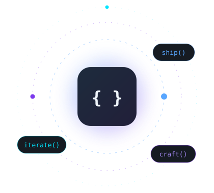

</td>
</tr>
</table>

<h2 align="center">Tech Stack</h2>

Grouped by what I actually ship with — bars are honest self-assessments, not vibes.

<table width="100%" border="0" cellspacing="0" cellpadding="6">
<tr>
<td width="33%"></td>
<td width="33%"></td>
<td width="33%"></td>
</tr>
<tr>
<td width="33%"></td>
<td width="33%"></td>
<td width="33%"></td>
</tr>
</table>

<h2 align="center">Experience</h2>


<h2 align="center">Featured Projects</h2>

Live means live — click through and use them.

<table width="100%" border="0" cellspacing="0" cellpadding="8">
<tr>
<td width="50%" valign="top">
  <a href="https://harshtuli.vercel.app"></a>
  
<a href="https://harshtuli.vercel.app"><b>Live&nbsp;↗</b></a>&nbsp;&nbsp;·&nbsp;&nbsp;<a href="https://github.com/452Harsh/portfolio">Source</a>

</td>
<td width="50%" valign="top">
  <a href="https://ai-mock-interviews-iota-three.vercel.app"></a>
  
<a href="https://ai-mock-interviews-iota-three.vercel.app"><b>Live&nbsp;↗</b></a>&nbsp;&nbsp;·&nbsp;&nbsp;<a href="https://github.com/452Harsh/ai_mock_interviews">Source</a>

</td>
</tr>
<tr>
<td width="50%" valign="top">
  <a href="https://wadhwani-sherke-qo8u.vercel.app"></a>
  
<a href="https://wadhwani-sherke-qo8u.vercel.app"><b>Live&nbsp;↗</b></a>&nbsp;&nbsp;·&nbsp;&nbsp;<a href="https://github.com/452Harsh/wadhwani-sherke">Source</a>

</td>
<td width="50%" valign="top">
  <a href="https://github.com/452Harsh/TaskForge"></a>
  
<a href="https://github.com/452Harsh/TaskForge"><b>Source&nbsp;↗</b></a>

</td>
</tr>
</table>

<h2 align="center">GitHub Analytics</h2>

  

  


<!-- github-readme-stats.vercel.app is currently returning 503s (public instance
     rate-limited). Re-enable when it recovers, or self-host your own instance:

-->

<h2 align="center">Achievements</h2>


 


 

<h2 align="center">Fun Facts</h2>


<h2 align="center">Connect</h2>

The inbox is open — especially for AI products, e-commerce, or anything that needs to feel fast.

<table width="100%" border="0" cellspacing="0" cellpadding="6">
<tr>
<td width="33%"><a href="https://harshtuli.vercel.app"></a></td>
<td width="33%"><a href="https://www.linkedin.com/in/YOUR-LINKEDIN"></a></td>
<td width="33%"><a href="mailto:harshtuli452@gmail.com"></a></td>
</tr>
</table>

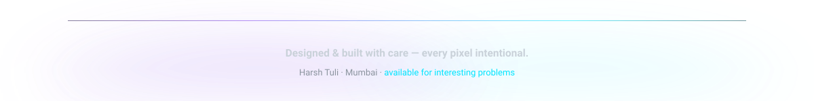
